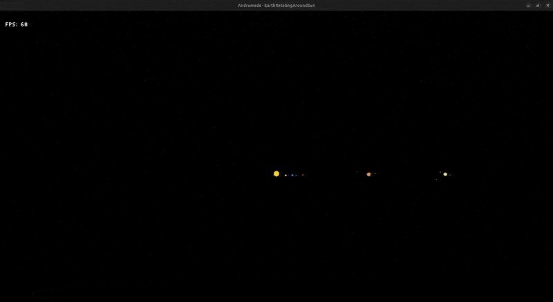

# Andromeda
A graphics engine made to display the solar system.




## Project Structure
```
Andromeda/
├── assets/           # Images, shaders, and other assets
├── cpp/              # Main C++ source code and modules
│   └── andromeda/    # Main C++ andromeda graphics engine source code
│   └── examples/     # Example projects and code samples
├── scripts/          # Build and setup scripts
├── build/            # Build output directory
├── README.md         # Project documentation
├── LICENSE           # License information
└── ...
```

## Setup & Building

1. Clone the repository:
    ```sh
    git clone https://github.com/ArturasDruteika/andromeda.git
    cd andromeda
    ```

2. Install the required Linux build dependencies:
    ```sh
    ./scripts/linux_setup.sh
    ```

3. Build the project:
    ```sh
    # Clang Release (default)
    ./scripts/linux_build.sh

    # Clang Debug
    ./scripts/linux_build.sh --config debug

    # GCC Release
    ./scripts/linux_build.sh --compiler gcc

    # GCC Debug
    ./scripts/linux_build.sh --compiler gcc --config debug
    ```

    Git submodules are initialized and updated automatically as part of the
    build process.

4. Create a Release installation:
    ```sh
    # Clang Release
    ./scripts/linux_install.sh

    # GCC Release
    ./scripts/linux_install.sh --compiler gcc
    ```

    Release installations are created in:
    ```text
    build/
    ├── linux_clang_install/
    │   ├── bin/
    │   └── lib/
    │
    └── linux_gcc_install/
        ├── bin/
        └── lib/
    ```

For more information about the Linux build scripts and available options, see
[`scripts/linux_build_scripts.md`](scripts/linux_build_scripts.md).

## Running Examples

For development, examples can be run directly from the corresponding build
directory after running `linux_build.sh`.

For Release builds, the recommended runtime layout is produced by
`linux_install.sh`. Installed executables can be found under:

```text
build/linux_clang_install/bin/
```

or, when building with GCC:

```text
build/linux_gcc_install/bin/
```

For example:

```sh
./build/linux_clang_install/bin/solar_system_simulation
```

All code examples can be found inside the `cpp/examples` directory.

## Running on VS Code (Linux)
1. **Install VS Code Extensions:**
    Install the __CMake__ and __CMake Tools__ extension in Visual Studio Code.
2. **Open the Project:**
    Open the project folder in VS Code.
3. **Configure Build Mode:**
    Using the CMake Tools extension, configure the project by selecting either debug or release mode. You can do this through the status bar or the command palette (Ctrl+Shift+P → "CMake: Configure").
4. **Build and Run:**
    You can use the VS Code build buttons, or simply run:
    ```sh
    ./scripts/build-linux.sh
    ```
    After a successful build, run the application from the build output directory.

## Supported Platforms
- Linux (tested)
- Windows (experimental, may require additional setup)

## Contribution Guidelines
Please see the [CONTRIBUTING.md](CONTRIBUTING.md) file for guidelines on contributing, coding standards, and submitting pull requests.

## Troubleshooting & Common Issues
- Ensure all submodules are initialized: `git submodule update --init --recursive`
- Make sure all build dependencies are installed (see setup instructions above).
- If you encounter build errors, try cleaning the build directory and rebuilding.
- For further help, open an issue on GitHub.

## License
This project is licensed under the MIT License. See the [LICENSE](LICENSE) file for details.

## Contact & Community
For questions, suggestions, or to report issues, please use the GitHub Issues page or contact the maintainer via your preferred method.

## Future Goals
1. Develop a 3D engine utilizing OpenGL that can render the [solar system application](https://github.com/ArturasDruteika/SolarSystem).
2. Implement ray tracing (very very very huge maybe, but if I live long enough and if aliens aren't going to destroy Earth I will).
3. (In the far far future) develop the same engine using Vulkan.

## Notes

### Contribution Guidelines
Please see the [CONTRIBUTING.md](CONTRIBUTING.md) file for guidelines on contributing, coding standards, and submitting pull requests.

### Troubleshooting & Common Issues
- Ensure all submodules are initialized: `git submodule update --init --recursive`
- Make sure all build dependencies are installed (see setup instructions above).
- If you encounter build errors, try cleaning the build directory and rebuilding.
- For further help, open an issue on GitHub.

### License
This project is licensed under the MIT License. See the [LICENSE](LICENSE) file for details.

### Contact & Community
For questions, suggestions, or to report issues, please use the GitHub Issues page or contact the maintainer via your preferred method.
### Future goals
1. Develop a 3D engine utilizing OpenGL that can render the [solar system application](https://github.com/ArturasDruteika/SolarSystem).
2. Implement ray tracing (very very very huge maybe, but if I live long enough and if aliens aren't going to destroy Earth I will).
3. (In the far far future) develop the same engine using Vulkan.

